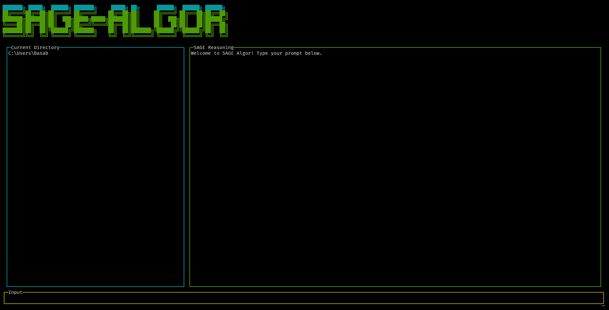

# SAGE-ALGOR

<div align="center">




[](https://badge.fury.io/js/%40sage%2Falgor)
[](https://opensource.org/licenses/MIT)
[](https://nodejs.org/)
[](https://ollama.com/)
[](https://huggingface.co/comethrusws)

*A powerful CLI-based code agent powered by SAGE AI models*

[Installation](#installation) •
[Features](#features) •
[Usage](#usage) •
[Commands](#commands) •
[Models](#models) •
[Contributing](#contributing)

</div>

---

## Overview

SAGE-ALGOR is an intelligent CLI-based coding assistant developed by **SAGEA AI**. It leverages the power of our proprietary SAGE models (3B, 8B, and 14B parameters) through Ollama to provide developers with an interactive coding companion that can help with code generation, debugging, explanations, and more.

## Features

- **AI-Powered Assistance**: Leverages SAGE reasoning models for intelligent code assistance
- **Interactive CLI Interface**: Beautiful terminal UI with syntax highlighting
- **File Operations**: Edit, read, and manage files directly from the CLI
- **Command Execution**: Run shell commands within the assistant
- **Context Awareness**: Load files into context for better assistance
- **Markdown Support**: Rich markdown formatting for responses
- **Keyboard Shortcuts**: Intuitive shortcuts for efficient workflow
- **Command History**: Navigate through previous commands
- **Multiple Model Support**: Choose from SAGE 3B, 8B, or 14B models

## Prerequisites

> [!NOTE]
> **Ollama Installation Required**: Before using SAGE-ALGOR, you must have Ollama installed on your system.

### Install Ollama

**macOS/Linux:**
```bash
curl -fsSL https://ollama.com/install.sh | sh
```

**Windows:**
Download and install from [ollama.com/download](https://ollama.com/download)

## Installation

### Global Installation (Recommended)

```bash
npm install -g @sage/algor
```

### Local Installation

```bash
git clone https://github.com/sagea-ai/sage-algor.git
cd sage-algor
npm install
```

The installation process will automatically:
1. Check for Ollama installation
2. Pull the default SAGE model (`comethrusws/sage-reasoning:3b`)
3. Set up the CLI environment

## Usage

### Start the CLI

```bash
algor
```

### Basic Interaction

Once launched, you can:
- Ask questions directly to get AI assistance
- Use commands for specific actions (prefixed with `/`)
- Load files into context for better assistance
- Execute shell commands

### Example Session

```
╭────────────────────────────────────────────────────────────────╮
│ Ask questions, edit files, or run commands.                    │
│ Be specific for the best results.                              │
│ Create SAGE.md files to customize your interactions.           │
│ /help for more information.                                    │
╰────────────────────────────────────────────────────────────────╯

> How do I implement a binary search in Python?
> /edit src/main.py
> /run npm test
```

## Commands

| Command | Description | Example |
|---------|-------------|---------|
| `/help` | Display help message | `/help` |
| `/about` | Show version information | `/about` |
| `/clear` | Clear the screen | `/clear` |
| `/edit <file>` | Load a file into context | `/edit src/app.js` |
| `/run <command>` | Execute a shell command | `/run npm install` |
| `/test <file>` | Run tests for a file *(Coming Soon)* | `/test main.py` |
| `/history` | Display command history *(Coming Soon)* | `/history` |
| `exit` or `/quit` | Exit the application | `exit` |

## Keyboard Shortcuts

| Shortcut | Action |
|----------|--------|
| `Ctrl+C`, `q`, `Escape` | Quit application |
| `Ctrl+L` | Clear the screen |
| `↑` / `↓` | Navigate command history |
| `Enter` | Send message |

## SAGE Models

SAGE-ALGOR currently supports our family of SAGE reasoning models:

### Available Models

| Model | Parameters | Use Case | Performance |
|-------|------------|----------|-------------|
| **SAGE 3B** | 3 Billion | General coding assistance, fast responses | Fast |
| **SAGE 8B** | 8 Billion | Complex reasoning, detailed explanations | Balanced |
| **SAGE 14B** | 14 Billion | Advanced problem solving, research tasks | Precise |

### Default Model

The CLI uses `comethrusws/sage-reasoning:3b` by default, which provides an excellent balance of speed and capability for most coding tasks.

> [!TIP]
> Future versions will allow model switching directly from the CLI interface.

## Project Structure

```
sage-algor/
├── bin/
│   └── cli.js              # CLI entry point
├── src/
│   ├── app.js              # Main application logic
│   ├── commands/
│   │   └── handler.js      # Command handling
│   ├── ollama/
│   │   └── client.js       # Ollama integration
│   └── ui/
│       └── logo.js         # ASCII logo rendering
├── scripts/
│   └── install.js          # Post-install setup
├── images/
│   ├── sagea-logo.png      # Company logo
│   └── algor.png           # CLI UI preview
└── package.json
```

## Development

### Local Development Setup

```bash
# Clone the repository
git clone https://github.com/sagea-ai/sage-algor.git
cd sage-algor

# Install dependencies
npm install

# Run in development mode
node bin/cli.js
```

### Requirements

- Node.js >= 16.0.0
- Ollama installed and running
- SAGE model downloaded

## Contributing

We welcome contributions to SAGE-ALGOR! Please see our [Contributing Guidelines](CONTRIBUTING.md) for details.

### Development Workflow

1. Fork the repository
2. Create a feature branch
3. Make your changes
4. Add tests if applicable
5. Submit a pull request

## License

This project is licensed under the MIT License - see the [LICENSE](LICENSE) file for details.

## Roadmap

- [ ] Multi-model support with runtime switching
- [ ] Plugin system for extensions
- [ ] Advanced file operations
- [ ] Git integration
- [ ] Code analysis and suggestions
- [ ] Team collaboration features

---

<div align="center">


[](https://sagea.space)

</div>